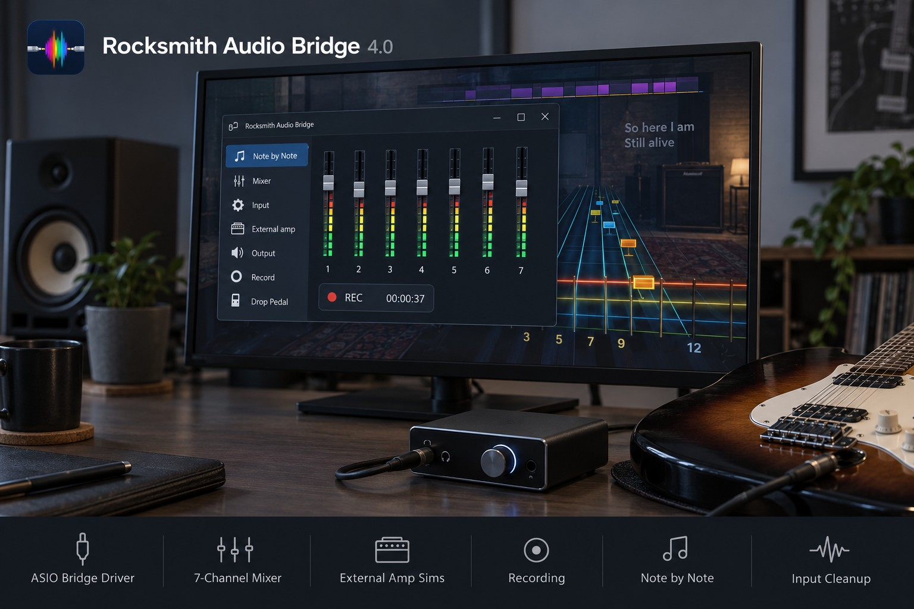
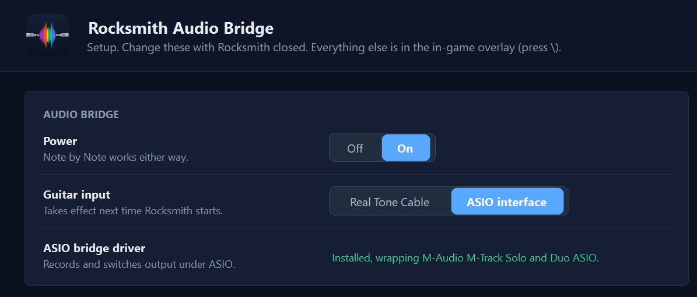
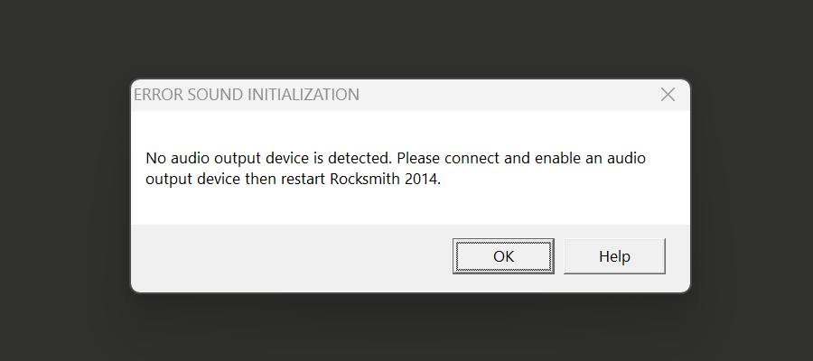
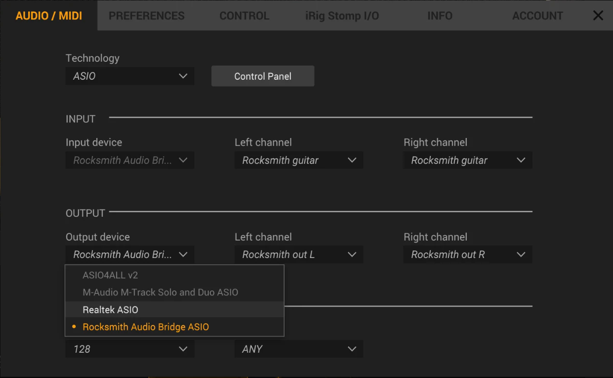

# Rocksmith Audio Bridge

 

An extension of [RSMods](https://github.com/Lovrom8/RSMods) for Rocksmith 2014
Remastered. Play any song without retuning, run your own amp sim, record your
playing, and practise note by note, with stable audio on speakers and
headphones Rocksmith can't normally use. Everything is controlled from an in-game
overlay.

Formerly RSModsPlus, renamed because the old name was easily mistaken for
Rocksmith+ and its expanded into a suite of features now.

---

  

  I build this mod in my own time and I'm currently looking for work. 
  If it has helped you, please consider <a href="#support">supporting its development</a>. Thank you

---

## Demo

https://github.com/user-attachments/assets/1b51d057-285e-4ded-a113-5c25af1f3346

**Features**

- [Stable audio on any speakers](#stable-audio-on-any-speakers)
- [Drop Pedal](#drop-pedal)
- [Speaker Mode](#speaker-mode)
- [Note by Note (beta)](#note-by-note-beta)
- [External amp](#external-amp)
- [Recording](#recording)
- [Mixer](#mixer)
- [Guitar input cleanup](#guitar-input-cleanup)
- [Output switching](#output-switching)

## Install

1. Close Rocksmith and RSMods.
2. Download `RocksmithAudioBridge-Installer.exe` from the
   [latest release](https://github.com/Cheesewizard/RocksmithAudioBridge/releases).
3. Run it and press **Install**. Accept the Windows admin prompt; it registers
   the Audio Bridge ASIO driver.

The installer includes the full RSMods suite, so you do not need to install
RSMods first. Run it again to **Reinstall / Repair** (for example after a Steam
file check) or **Uninstall**. Uninstall asks before removing your settings and
never touches your recordings.

Requirements: the Steam version of Rocksmith 2014 Remastered on Windows, and
the MS Visual C++ 2015-2019 redistributable. Works with a Real Tone Cable or an
ASIO interface through [RS_ASIO](https://github.com/mdias/rs_asio).

**ASIO users need RS_ASIO 0.7.2 or newer** (the
[latest release](https://github.com/mdias/rs_asio/releases/latest) is
recommended; 0.7.4 and 0.7.5 are tested). Older versions cause problems with
the current Rocksmith game patch:

- Before 0.6.0: RS_ASIO cannot patch the game. The sound is distorted and there
  is no guitar input, or the game closes.
- 0.6.0: crashes on the title screen when used with RSMods.
- 0.6.1 to 0.7.1: Rocksmith Audio Bridge 4.0 crashes after the profile screen.
  4.1 fixes this, but 0.7.2 or newer is still recommended (0.6.2 also has known
  compatibility issues).

To check your version, open `RS_ASIO-log.txt` in the Rocksmith folder; the
first line reads `Wrapper DLL loaded (vX.Y.Z)`. `RSMods_debug.txt` also names
the version and warns when it is too old. To update, download the release from
the official [RS_ASIO releases page](https://github.com/mdias/rs_asio/releases),
replace both `RS_ASIO.dll` and `avrt.dll`, and keep your own `RS_ASIO.ini`.

### After installing

With Rocksmith closed, open RSMods (`RSMods\RSMods.exe` in your Rocksmith
folder) and go to the **Rocksmith Audio Bridge** tab. Set **Guitar input** to
**Real Tone Cable** or **ASIO interface** to match how your guitar is
connected.

With an ASIO interface, the **ASIO bridge driver** row shows that the driver is
installed and which interface it is using.

## The overlay

Press `\` in game to open the Audio Bridge overlay. Each feature below says
which page of it to use. Overlay settings are saved to `RSMods.ini`.

Keys can be changed in RSMods.exe, on the Keybindings tab. Upgrading from an
earlier version keeps the keys you already had.

---

## Stable audio on any speakers

"No audio output device" is the most common reason a fresh Rocksmith install
won't start. The Audio Bridge gives Rocksmith its own input and output devices,
so one badly behaved Windows playback device can't stop the game from starting,
even with no speakers connected at all.

Rocksmith always sees the standard 48 kHz stereo device it expects, and the
Audio Bridge converts to whatever your real speakers or headphones use. So
devices at other sample rates (such as 44.1 kHz) or with surround layouts (such
as 5.1) play without errors or crackling. Sound goes to your Windows default
playback device, or to whichever one you pick in
[Output switching](#output-switching).

**Needs:** nothing with a Real Tone Cable. With an ASIO interface, set the
Audio Bridge driver in `RS_ASIO.ini`.

## Drop Pedal

Shifts your **guitar** to match the song, from -24 to +24 semitones, without
touching a tuning peg. Note detection, the tuner and scoring follow the shift,
and any tone works. In multiplayer each player has their own shift and base
tuning; a player who doesn't need a shift leaves theirs at 0.

To play an Eb song on an E-standard guitar, press `F7` once, then `,` once.

| Action | Player 1 | Player 2 |
|---|---|---|
| Cycle Drop Pedal / Speaker Mode / Off (both players) | `F7` | |
| Shift down / up one semitone | `,` / `.` | `Ctrl+,` / `Ctrl+.` |
| Set the guitar's physical tuning | `F9` | `Ctrl+F9` |

**Overlay page:** Drop Pedal (readout and colours).

## Speaker Mode

Shifts the **song** to match your guitar instead. Made for playing through
speakers, where you hear the guitar itself in the room. The song is
pitch-rendered ahead of time, so there is no added latency. Drop and open
tunings work too: the tuner tells you which strings to retune.

Press `F7` until the readout says `Speaker`, then use `,` and `.` as with the
Drop Pedal.

Speaker Mode is a global setting that only Player 1 can change; in
multiplayer, both players tune to Player 1's tuning. For separate settings per
player, use the Drop Pedal.

## Note by Note (beta)

A Riff Repeater practice mode that checks every note you play. Detection
combines the game's own matcher, a raw pitch verifier and a bundled
machine-learning detector, which starts on its own.

- **Flow mode** (on by default): the song keeps playing while you hit the
  notes, and stops at the first note you miss until you play it. The Riff
  Repeater speed is capped to what detection can keep up with.
- **Flow mode off:** the song waits at every note until you play it.

Turn it on in game with the **NOTE BY NOTE** switch in Riff Repeater Advanced
Settings; this menu is the only place to switch it on. The **FLOW MODE** switch
sits just below it.

| Action | Key |
|---|---|
| Emergency skip, if you ever get stuck on a note | `Right Arrow` |

**Overlay page:** Note by Note (settings only: readout, target style and size,
colours, and dragging the on-screen readout into place).

Works on guitar and bass arrangements. Bass support is experimental: it uses
the game's own detection with a bass-trained machine-learning model.

## External amp

Play through your own amp sim, such as AmpliTube 5, instead of Rocksmith's amp,
while the game keeps the clean signal for note detection. It shares your
interface with the game, adding one buffer of latency at your interface's
buffer size. When the amp sim closes, the game's amp comes back. The
[Drop Pedal](#drop-pedal) works with it too: the amp sim gets your shifted
guitar.

In the amp sim's audio settings, pick **Rocksmith Audio Bridge ASIO** as both
the input and output device. Set the input channels to **Rocksmith guitar** and
the outputs to **Rocksmith out L** and **Rocksmith out R**.

**Overlay page:** External amp (status, return level, safety buffer).

**Needs:** an ASIO interface with the Audio Bridge driver set as the `Driver` in
`RS_ASIO.ini`. The mod never edits `RS_ASIO.ini` for you.

## Recording

Record what you play without leaving the game. An audio take saves the full
game mix and your dry guitar together as a pair. A video take saves an MP4 with
the game sound.

The recording is exactly what you hear: the song, your guitar and, with
[External amp](#external-amp), your amp sim's tone. It works the same whichever
playback device the sound goes to. The dry take is your clean guitar, ready to
re-amp later. Each game launch saves into its own dated folder under
`Videos\Rocksmith Audio Bridge`.

Press `F6`, or the record button on the overlay's Record page. A red REC
indicator shows while recording.

**Overlay page:** Record (audio or video, the record key).

**Needs:** with an ASIO interface, the Audio Bridge driver set in
`RS_ASIO.ini` to record the game mix.

## Mixer

Seven volume faders: Master, Player 1, Player 2, Song, Microphone, Voice-over
and Effects. Player levels change only what you hear, never note detection.
Levels reset when the game closes.

**Overlay page:** Mixer.

## Guitar input cleanup

Fixes a quiet or noisy guitar signal before Rocksmith hears it: make-up gain, a
noise suppressor that keeps your sustain, a compressor, a hum filter that
removes only the mains hum, and an override for Rocksmith's own noise gate.
Works with a Real Tone Cable or an ASIO interface.

**Overlay page:** Input (with a live level meter).

## Output switching

Move the game's sound to another playback device while you play, with no
restart. The change lasts until you close Rocksmith. An optional limiter caps
the maximum volume.

**Overlay page:** Output.

---

Everything else (extended range, custom song list titles, toggle loft and the
rest) comes from RSMods and works as
[upstream documents it](https://github.com/Lovrom8/RSMods#readme). The overlay's
General page can also rescan the song list after you add a new song, without
restarting.

## Support

Rocksmith Audio Bridge is free, and I develop it entirely in my own time while
looking for work. If the mod has made Rocksmith better for you, a beer goes a
long way towards keeping it going. Thank you!

## Reporting problems

Report bugs [here](https://github.com/Cheesewizard/RocksmithAudioBridge/issues), not on
the RSMods tracker. A bug in an inherited RSMods feature that also happens on
plain RSMods belongs [upstream](https://github.com/Lovrom8/RSMods/issues).

Attach the logs from `%LOCALAPPDATA%\Rocksmith Audio Bridge\Logs` and `RSMods_debug.txt` from
the Rocksmith folder. With an ASIO interface, also attach `RS_ASIO-log.txt` and `RS_ASIO.ini`. The debug log is locked while the game runs, so quit
first.

## Credits

RSMods is the work of **Lovrom8** and **ffio1**, with contributions from
ZagatoZee, Kokolihapihvi and L0fka.
[RS_ASIO](https://github.com/mdias/rs_asio) by **mdias** makes the ASIO path
possible. [Signalsmith Stretch](https://github.com/Signalsmith-Audio/signalsmith-stretch)
by **Signalsmith Audio** does Speaker Mode's pitch shifting. Full third-party
notices are in [NOTICE](NOTICE).

Code written for this project is MIT licensed ([LICENSE](LICENSE)). RSMods code
remains its authors' property.
